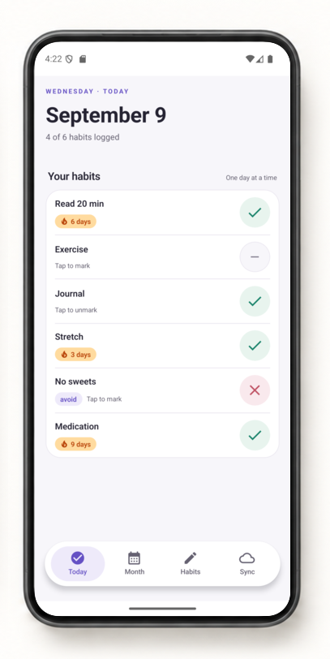
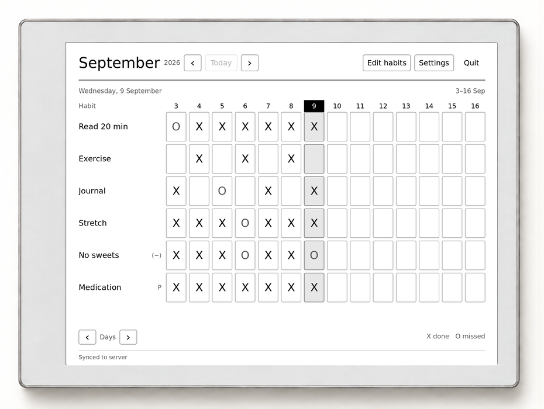
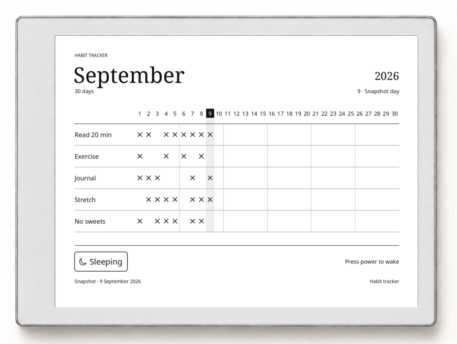
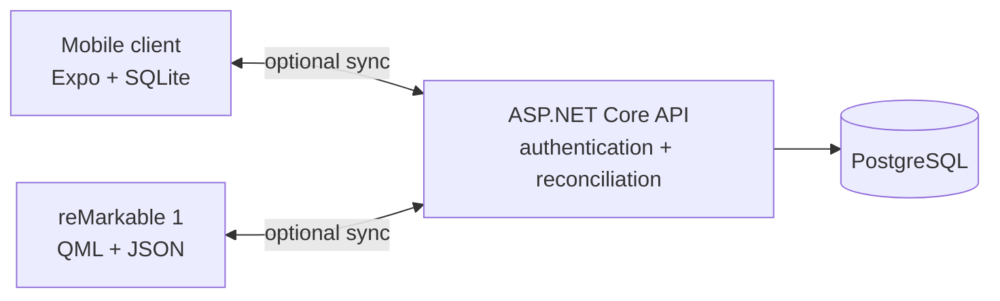
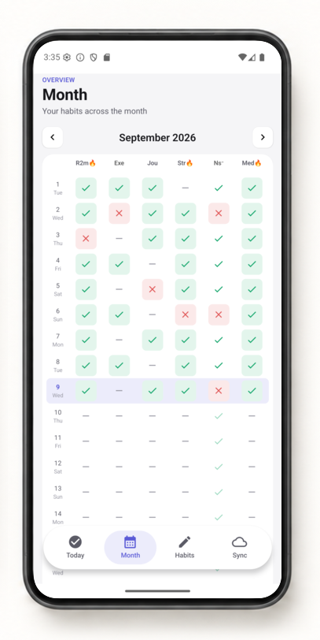
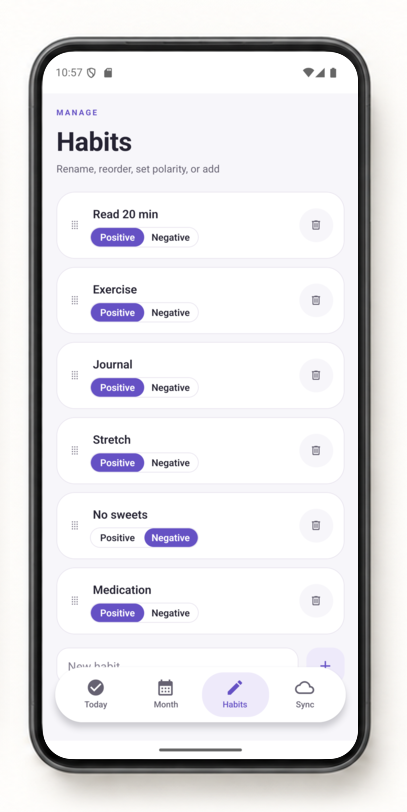
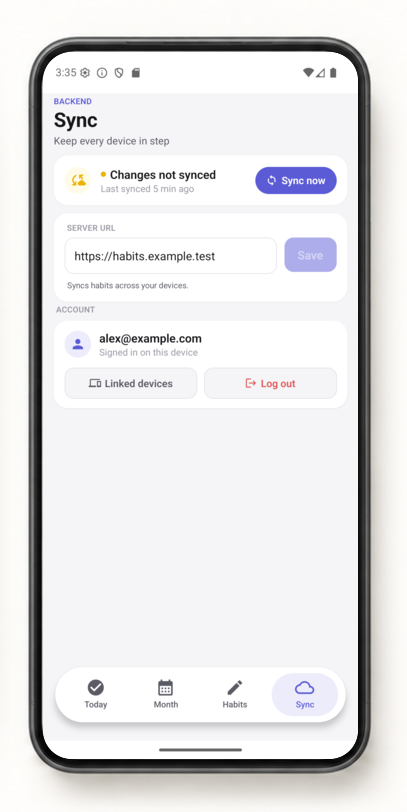
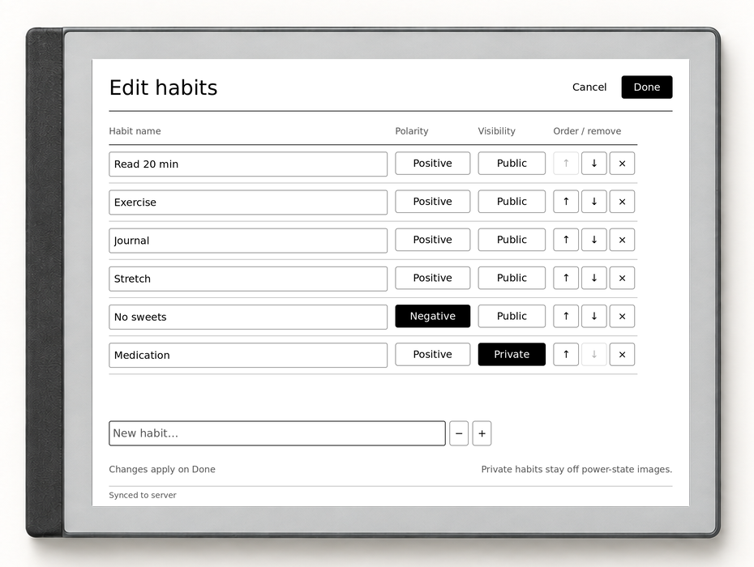
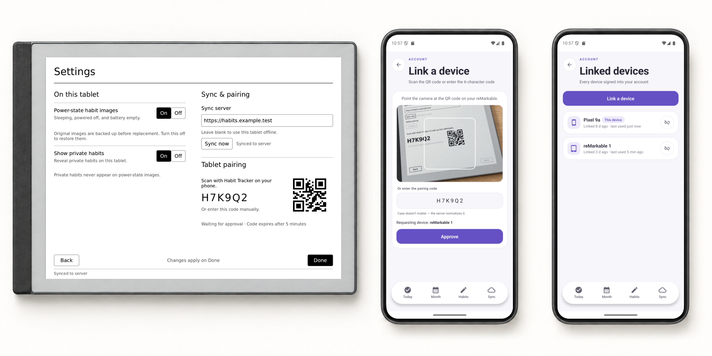

# Habit Tracker

> Cross-platform, offline-first habit tracking for mobile and reMarkable.

Track daily habits, review your history, and manage your routines from your phone or e-ink tablet.
Each client works independently with local storage. Connect either or both to a self-hosted sync
service to keep your habits up to date across devices.

<table>
  <tr>
    <td width="20%" align="center" valign="middle"><a href="docs/assets/screenshots/android-today.png"></a></td>
    <td width="40%" align="center" valign="middle"><a href="docs/assets/screenshots/remarkable-grid.png"></a></td>
    <td width="40%" align="center" valign="middle"><a href="docs/assets/screenshots/remarkable-suspend.png"></a></td>
  </tr>
  <tr>
    <td align="center"><sub><b>Mobile</b> · Daily logging and streaks</sub></td>
    <td align="center"><sub><b>reMarkable</b> · Habits at a glance on e-ink</sub></td>
    <td align="center"><sub><b>Sleep screen</b> · Public habits visible while it sleeps</sub></td>
  </tr>
</table>

Screenshots show the real Android and reMarkable interfaces with fictional sample data in
[decorative device frames](tools/readme-screenshots/README.md#device-frames).
Select an image for a larger view.

## Table of contents

- [Architecture](#architecture)
- [Features](#features)
- [Getting started](#getting-started)
- [Screenshots](#screenshots)
- [Development](#development)
- [Privacy and data ownership](#privacy-and-data-ownership)
- [Contributing](#contributing)
- [License](#license)

## Architecture

Mobile and reMarkable are peer clients. Both save changes locally and sync through the same API,
which owns authentication and reconciles records in PostgreSQL. Daily tracking works without a
server or network connection.



| Component         | Stack                                           | Documentation                                 |
| ----------------- | ----------------------------------------------- | --------------------------------------------- |
| Mobile client     | Expo, React Native, TypeScript, SQLite, Drizzle | [Mobile guide](apps/mobile/README.md)         |
| reMarkable client | QML, Qt 5.15, JavaScript, XOVI, rm-appload      | [reMarkable guide](apps/remarkable/README.md) |
| Sync service      | ASP.NET Core 10, EF Core, PostgreSQL            | [Backend guide](apps/backend/README.md)       |

The backend defines the shared contract through a committed [OpenAPI document](apps/backend/openapi.json).
It merges timestamped changes and deletion records using last-write-wins reconciliation; each
client keeps the storage and presentation model suited to its platform.

## Features

- **Offline tracking.** Log and edit habits locally, with no account or server required for standalone use.
- **Positive and negative habits.** Track what you want to do and what you want to avoid, with daily outcomes and month history.
- **Habit management.** Add, rename, reorder, change polarity, and delete habits from either client.
- **Optional sync.** Use your own server, see connection state, and sync local changes across devices.
- **Device linking.** Sign in on mobile, approve a reMarkable pairing code, and review or revoke linked sessions.

Each client presents the same habits in a way that fits its display:

| Mobile                                                        | reMarkable                                                        |
| ------------------------------------------------------------- | ----------------------------------------------------------------- |
| Today view with progress, streaks, and slip tracking          | High-contrast month grid with X/O marks and today highlighting    |
| Portrait month review with days as rows and habits as columns | Landscape layout with horizontal and vertical paging              |
| Manual and pull-to-refresh sync                               | Optional habit grid on the sleep screen, excluding private habits |

### Supported platforms

| Platform     | Status                                       |
| ------------ | -------------------------------------------- |
| Android      | Supported native client                      |
| reMarkable 1 | Supported through XOVI + rm-appload          |
| iOS          | Build target present; not currently verified |
| Web          | Not supported                                |

The project is currently distributed as source and internal builds; there is no app-store release.

## Getting started

Choose a client to run on its own, or set up the optional backend to sync devices.

### Prerequisites

- Node.js and pnpm for workspace commands and mobile dependencies. The repository pins its pnpm version in [`package.json`](package.json).
- **Mobile:** an Android device or emulator and the Android build tools for a native build. See the [mobile guide](apps/mobile/README.md#run-it) for Expo development options.
- **reMarkable:** a reMarkable 1 with XOVI and rm-appload installed, plus Qt 5's resource compiler on your computer.
- **Sync service:** the .NET 10 SDK and Docker for the local PostgreSQL database.

### Clone and install

```sh
git clone https://github.com/kris10ansn/habit-tracker.git
cd habit-tracker
pnpm install
```

Run the commands below from the repository root unless shown otherwise.

### Mobile

Build and open the Android client:

```sh
pnpm mobile:android
```

For an existing development client or Expo Go, start the development server with `pnpm mobile:start`.
You can add habits locally and configure a server later from the Sync tab.

[Mobile setup and development →](apps/mobile/README.md)

### reMarkable

Install [XOVI](https://github.com/asivery/xovi) and [rm-appload](https://github.com/asivery/rm-appload)
on the tablet, then build and deploy the client from your computer:

```sh
cd apps/remarkable
make build
make deploy
```

Open the tracker from the tablet's app launcher. It stores habits locally; Settings contains the
optional sync and sleep-screen controls.

[Installation, SSH configuration, backups, and upgrades →](apps/remarkable/README.md)

### Optional sync service

Start PostgreSQL, apply migrations, and run the API:

```sh
pnpm backend:db:up
pnpm backend:migrate
pnpm backend:start
```

The development API listens on `http://localhost:5137`. Configure each client's server address
using a hostname or IP reachable from that device, then sign up or log in on mobile. To link a
tablet, request a code in its Settings and approve it from the phone's Linked devices page.

[Backend configuration and API documentation →](apps/backend/README.md)

## Screenshots

### Mobile: review, manage, and sync

Review a month of entries, manage your habits, and see which changes are waiting to sync.

<table>
  <tr>
    <td width="33%" align="center"><a href="docs/assets/screenshots/android-month.png"></a></td>
    <td width="33%" align="center"><a href="docs/assets/screenshots/android-habits.png"></a></td>
    <td width="33%" align="center"><a href="docs/assets/screenshots/android-sync.png"></a></td>
  </tr>
  <tr>
    <td align="center"><sub>Review the month</sub></td>
    <td align="center"><sub>Manage habits and polarity</sub></td>
    <td align="center"><sub>Sync and account controls</sub></td>
  </tr>
</table>

### reMarkable: edit and keep habits visible

Edit habits directly on the tablet and optionally keep the month grid visible while it sleeps.
Private habits stay off the sleep screen.

<table>
  <tr>
    <td width="50%"><a href="docs/assets/screenshots/remarkable-edit.png"></a></td>
    <td width="50%"><a href="docs/assets/screenshots/remarkable-suspend.png"></a></td>
  </tr>
  <tr>
    <td align="center"><sub>Rename, reorder, and set habit privacy</sub></td>
    <td align="center"><sub>Keep public habits visible while it sleeps</sub></td>
  </tr>
</table>

### Linking devices

The phone identifies the requesting tablet before you approve it. Linked devices lists your
sessions so you can review or revoke access.

<p align="center">
  <a href="docs/assets/screenshots/framed/device-linking.png"></a>
  <br>
  <sub>1. Request a code on reMarkable · 2. Approve on mobile · 3. Review linked devices</sub>
</p>

## Development

This is a pnpm monorepo with independent clients and a shared backend contract:

```text
.
├── apps/
│   ├── mobile/       Expo / React Native client
│   ├── remarkable/   QML client and suspend-image renderer
│   └── backend/      ASP.NET Core API and PostgreSQL persistence
├── docs/             Project documentation and screenshot assets
├── tools/            Screenshot capture, fixtures, and device framing
├── CONTEXT.md        Shared habit-domain vocabulary
└── package.json      Workspace commands
```

### Checks

Run the checks for the applications you change:

```sh
pnpm lint
pnpm typecheck
pnpm backend:test
pnpm remarkable:test
```

The reMarkable tests need `qmltestrunner-qt5`. Changes to its drawing logic also use the host
suspend-renderer smoke test, which requires a C++ toolchain and Qt 5 development headers:

```sh
make -C apps/remarkable suspend-writer-test
```

### API and data changes

- Rebuild the committed OpenAPI document with `pnpm backend:build` after changing the API contract, then regenerate the mobile wire layer with `pnpm mobile:api:generate`.
- Generate mobile SQLite migrations with `pnpm mobile:db:generate` after changing its schema.
- Follow the [reMarkable upgrade guide](apps/remarkable/README.md#upgrading-across-a-storage-format-change) for tablet storage changes.
- Shared terms live in [`CONTEXT.md`](CONTEXT.md); each app has its own context and development guide.

### Updating screenshots

The reMarkable captures render the production QML scene and sleep-screen drawing logic offscreen.
Android captures come from an isolated native test project. Both use the same fictional fixture.

```sh
pnpm screenshots:remarkable
pnpm screenshots:frame
pnpm screenshots:linking
```

For mobile fixture setup, manual capture, and framing instructions, see the
[screenshot workflow](tools/readme-screenshots/README.md).

## Privacy and data ownership

- There is no telemetry.
- Both clients keep habit data locally and continue working offline.
- Sync is opt-in; the backend is self-hosted and keeps each account's records separate.
- Private habits are excluded from the reMarkable sleep screen. Its main-grid reveal setting stays local to that tablet.
- Session tokens can be revoked from the linked-device list without deleting local habit data.

## Contributing

Issues and pull requests are welcome. Read [CONTRIBUTING.md](CONTRIBUTING.md) for project boundaries,
generated-code requirements, and checks. Open an issue before a large feature or architectural
change so the scope can be agreed first.

## License

Habit Tracker is licensed under the [GNU Affero General Public License v3.0 or later](LICENSE).
Third-party components remain under their respective licenses.
