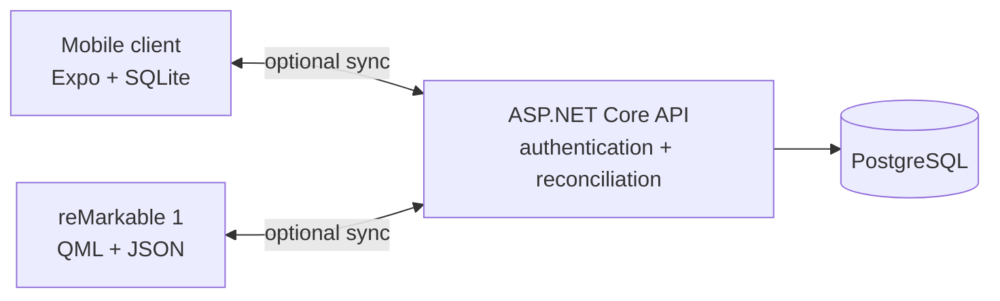
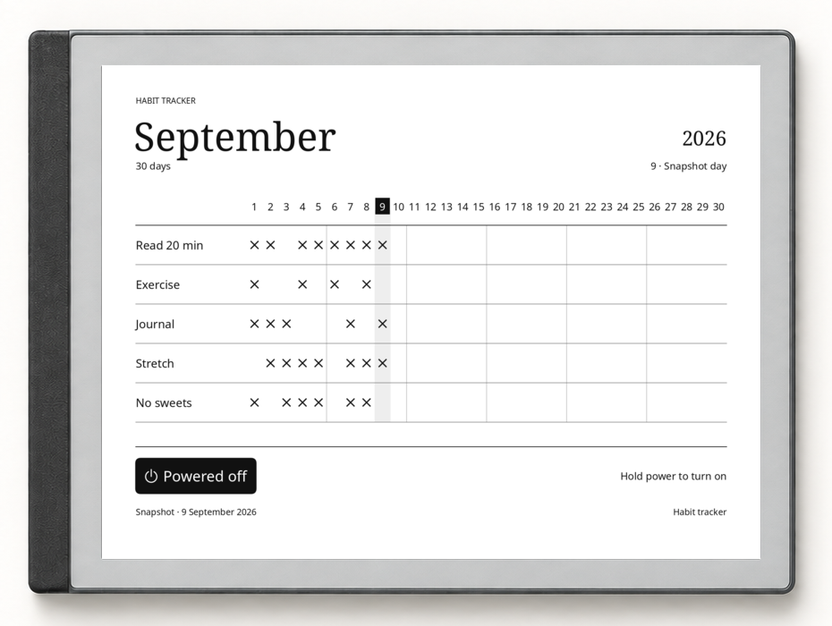
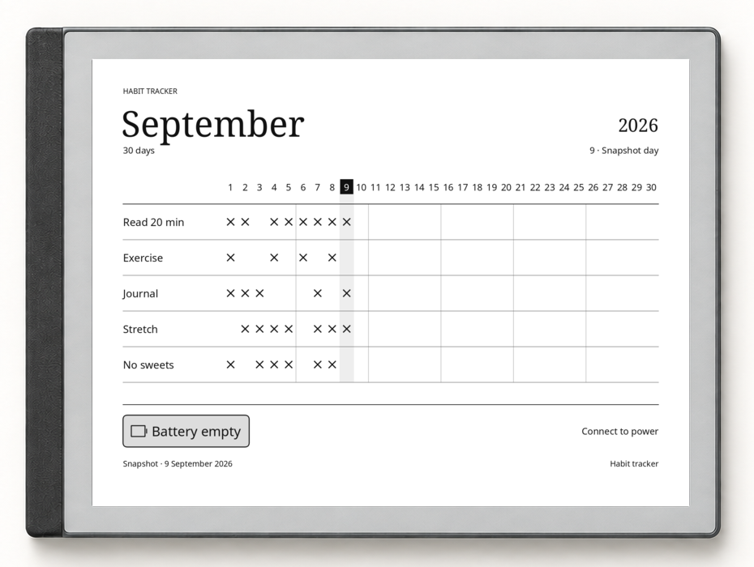

# Habit Tracker

> Cross-platform, offline-first habit tracking for mobile and reMarkable.

Track daily habits, review your history, and manage your routines from your phone or e-ink tablet.
Each client works independently with local storage. Connect either or both to a self-hosted sync
service to keep your habits up to date across devices.
[Link your phone and tablet](#link-your-devices) with a pairing code approved from mobile.

## Table of contents

- [Architecture](#architecture)
- [Features](#features)
- [Getting started](#getting-started)
- [Development](#development)
- [Privacy and data ownership](#privacy-and-data-ownership)
- [Contributing](#contributing)
- [License](#license)

## Architecture

Mobile and reMarkable are peer clients. Both save changes locally and sync through the same API,
which owns authentication and reconciles records in PostgreSQL. Daily tracking works without a
server or network connection.



| Component         | Stack                                                  | Documentation                                 |
| ----------------- | ------------------------------------------------------ | --------------------------------------------- |
| Mobile client     | Expo SDK 57, React Native, TypeScript, SQLite, Drizzle | [Mobile guide](apps/mobile/README.md)         |
| reMarkable client | QML, Qt 5.15, JavaScript, XOVI, rm-appload             | [reMarkable guide](apps/remarkable/README.md) |
| Sync service      | ASP.NET Core 10, EF Core, PostgreSQL                   | [Backend guide](apps/backend/README.md)       |

The backend defines the shared contract through a committed [OpenAPI document](apps/backend/openapi.json).
It merges timestamped changes and deletion records using last-write-wins reconciliation; each
client keeps the storage and presentation model suited to its platform.

## Features

### Log your day

Track habits you want to build and habits you want to avoid. On mobile, **Today** puts each habit's
mark beside its streak. Positive habits cycle from unmarked to done to missed; negative habits
start clean, and you mark a slip when one happens. On reMarkable, tap X/O cells directly in the
month grid, with today's column highlighted. The tablet adjusts row height to fit the roster
and provides paging for larger grids. Both clients save locally and work offline without an account.

<table>
  <tr>
    <td width="30%" align="center" valign="middle"><a href="docs/assets/screenshots/android-today.png"></a></td>
    <td width="70%" align="center" valign="middle"><a href="docs/assets/screenshots/remarkable-grid.png"></a></td>
  </tr>
  <tr>
    <td align="center"><sub>Today brings marks and streaks together for daily logging.</sub></td>
    <td align="center"><sub>The tablet keeps daily marks in the context of the whole month.</sub></td>
  </tr>
</table>

Illustrations show the real interfaces with fictional sample data in
[decorative device frames](tools/readme-screenshots/README.md#device-frames).
Select an image for a larger view.

### Link your devices

Keep your phone and tablet connected to the same habit history through your self-hosted sync
service. Request a pairing code on reMarkable, then scan or enter it on mobile and approve the
requesting device. Review or revoke connected sessions from **Linked devices** on your phone.
See [Pair a tablet](#pair-a-tablet) for setup instructions.

<p align="center">
  <a href="docs/assets/screenshots/framed/device-linking.png"></a>
  <br>
  <sub>1. Request a code on reMarkable · 2. Approve on mobile · 3. Review linked devices</sub>
</p>

### Adjust your routines

Add, rename, reorder, change polarity, and delete habits from either client. Use **Habits** on
mobile or **Edit habits** on reMarkable. The tablet editor stages changes until **Done** and
uses **Public / Private** to control habit privacy. See
[Privacy and data ownership](#privacy-and-data-ownership) for how that affects visibility.

<table>
  <tr>
    <td width="30%" align="center" valign="middle"><a href="docs/assets/screenshots/android-habits.png"></a></td>
    <td width="70%" align="center" valign="middle"><a href="docs/assets/screenshots/remarkable-edit.png"></a></td>
  </tr>
  <tr>
    <td align="center"><sub>On mobile, edit names and polarity, drag to reorder, or add a habit.</sub></td>
    <td align="center"><sub>The tablet editor stages names, order, polarity, and privacy until Done.</sub></td>
  </tr>
</table>

### Review and correct past entries

Mobile's **Month** view places days in rows and habits in columns to fit a portrait screen.
Navigate to a previous month to review or correct its entries; future days are view-only.
On reMarkable, use the arrows beside the month title to browse history and **Today** to return.

<p align="center">
  <a href="docs/assets/screenshots/android-month.png"></a>
  <br>
  <sub>Each row is one day, making it easy to compare habits across the month.</sub>
</p>

### Supported platforms

| Platform     | Status                                       |
| ------------ | -------------------------------------------- |
| Android      | Supported native client                      |
| reMarkable 1 | Supported through XOVI + rm-appload          |
| iOS          | Build target present; not currently verified |
| Web          | Not supported                                |

The project is currently distributed as source and internal builds; there is no app-store release.

## Getting started

Choose a client to run on its own, or set up the optional backend to sync devices.

### Prerequisites

- Node.js and pnpm for workspace commands and mobile dependencies. The repository pins its pnpm version in [`package.json`](package.json).
- **Mobile:** an Android device or emulator and the Android build tools for a native build. See the [mobile guide](apps/mobile/README.md#run-it) for Expo development options.
- **reMarkable:** a reMarkable 1 with XOVI and rm-appload installed, plus Qt 5's resource compiler on your computer.
- **Sync service:** the .NET 10 SDK and Docker for the local PostgreSQL database.

### Clone and install

```sh
git clone https://github.com/kris10ansn/habit-tracker.git
cd habit-tracker
pnpm install
```

Run the commands below from the repository root unless shown otherwise.

### Mobile

Build and open the Android client:

```sh
pnpm mobile:android
```

For an existing development client or Expo Go, start the development server with `pnpm mobile:start`.
You can add habits locally and configure a server later from the Sync tab.

[Mobile setup and development →](apps/mobile/README.md)

### reMarkable

Install [XOVI](https://github.com/asivery/xovi) and [rm-appload](https://github.com/asivery/rm-appload)
on the tablet, then build and deploy the client from your computer:

```sh
cd apps/remarkable
make build
make deploy CONFIRM_STABLE=1
```

Open the tracker from the tablet's app launcher. It stores habits locally; Settings contains the
optional sync and power-state habit image controls. For an isolated test installation, follow
[Testing alongside your working app](apps/remarkable/README.md#testing-alongside-your-working-app).

[Installation, SSH configuration, backups, and upgrades →](apps/remarkable/README.md)

### Optional sync service

Start PostgreSQL, apply migrations, and run the API:

```sh
pnpm backend:db:up
pnpm backend:migrate
pnpm backend:start
```

The development API listens on port `5137`, including your computer's network interfaces.
On mobile, enter its reachable base address in **Sync → Server URL** and tap **Save**.
Use `http://10.0.2.2:5137` for a local Android emulator, or your computer's LAN address
(for example, `http://192.168.1.50:5137`) for a phone or tablet on the same network.
`localhost` on a device refers to that device, not the computer running the API.

Sign up or log in on mobile, then tap **Sync now**. The first account on a new server becomes
its administrator; later signups require an administrator-issued invite. The **Sync** tab brings
the saved server address, signed-in account, and pending-change status together:

<p align="center">
  <a href="docs/assets/screenshots/android-sync.png"></a>
  <br>
  <sub>Check the sync status and account here after saving your server address.</sub>
</p>

### Pair a tablet

To link a tablet, save the same server's address in its Settings, request a code with **Connect**,
and approve it from **Sync → Linked devices → Link a device** on the phone. Review the requesting
device before approving, and keep tablet Settings open until pairing completes. **Linked devices**
then lets you review or revoke its session.

See the [backend setup guide](apps/backend/README.md#accounts-and-first-sync) for account creation
and the [mobile guide](apps/mobile/README.md#troubleshooting) for connection problems.

[Backend configuration and API documentation →](apps/backend/README.md)

## Development

This is a pnpm monorepo with independent clients and a shared backend contract:

```text
.
├── apps/
│   ├── mobile/       Expo / React Native client
│   ├── remarkable/   QML client and power-state image renderer
│   └── backend/      ASP.NET Core API and PostgreSQL persistence
├── docs/             Project documentation and screenshot assets
├── tools/            Screenshot capture, fixtures, and device framing
├── CONTEXT.md        Shared habit-domain vocabulary
└── package.json      Workspace commands
```

### Checks

Run the checks for the applications you change:

```sh
pnpm lint
pnpm typecheck
pnpm backend:test
pnpm remarkable:test
```

The reMarkable tests need `qmltestrunner-qt5`. Changes to its drawing logic also use the host
suspend-renderer smoke test, which requires a C++ toolchain and Qt 5 development headers:

```sh
make -C apps/remarkable suspend-writer-test
```

### API and data changes

- Rebuild the committed OpenAPI document with `pnpm backend:build` after changing the API contract, then regenerate the mobile wire layer with `pnpm mobile:api:generate`.
- Generate mobile SQLite migrations with `pnpm mobile:db:generate` after changing its schema.
- Follow the [reMarkable upgrade guide](apps/remarkable/README.md#upgrading-across-a-storage-format-change) for tablet storage changes.
- Shared terms live in [`CONTEXT.md`](CONTEXT.md); each app has its own context and development guide.

### Updating screenshots

The reMarkable captures render the production QML scene and power-state drawing logic offscreen.
Android captures use an isolated Expo Go test project on a local emulator. Both use the same
fictional fixture. With an emulator already running and compatible Expo Go installed, regenerate
Android captures, device frames, and the linking illustration together:

```sh
pnpm mobile:test:readme
```

To update the tablet images, then refresh the linking illustration with the latest captures:

```sh
pnpm screenshots:remarkable
pnpm screenshots:linking
```

For automated Expo Go capture prerequisites, fixture setup, manual capture, and separate framing
commands, see the [screenshot workflow](tools/readme-screenshots/README.md).
Review that workflow and the README images after changes to mobile screens, fixtures, or native
configuration.

## Privacy and data ownership

On reMarkable, enable **Power-state habit images** in **Settings** to show a dated snapshot of
the current month while the tablet sleeps, is powered off, or has an empty battery. Each image
identifies the state and how to wake or power the tablet; the snapshot stays unchanged while it
is off. Private habits are excluded from all three images, even when revealed in the app.
The app backs up all three originals before replacing them and restores them when you disable
the setting. In this example, Medication appears in the app's grid above but is absent from
the sleep screen:

<p align="center">
  <a href="docs/assets/screenshots/remarkable-suspend.png"></a>
  <br>
  <sub>Only public habits appear on the sleep screen, even when private habits are revealed in the app.</sub>
</p>

<table>
  <tr>
    <td width="50%"><a href="docs/assets/screenshots/remarkable-poweroff.png"></a></td>
    <td width="50%"><a href="docs/assets/screenshots/remarkable-batteryempty.png"></a></td>
  </tr>
  <tr>
    <td align="center"><sub>The powered-off snapshot shows how to turn the tablet on.</sub></td>
    <td align="center"><sub>The battery-empty snapshot prompts you to connect power.</sub></td>
  </tr>
</table>

- There is no telemetry.
- Both clients keep habit data locally and continue working offline.
- Sync is opt-in; the backend is self-hosted and keeps each account's records separate.
- Private habits are excluded from every reMarkable power-state image. Its main-grid reveal setting stays local to that tablet.
- The private flag controls visibility; private habits still participate in sync and remain visible on mobile.
- Session tokens can be revoked from the linked-device list without deleting local habit data.
- Sync propagates deletions, so it is not a backup. Keep tablet data backups and database backups before upgrades or resets; mobile currently has no in-app export or restore flow.

## Contributing

Issues and pull requests are welcome. Read [CONTRIBUTING.md](CONTRIBUTING.md) for project boundaries,
generated-code requirements, and checks. Open an issue before a large feature or architectural
change so the scope can be agreed first.

## License

Habit Tracker is licensed under the [GNU Affero General Public License v3.0 or later](LICENSE).
Third-party components remain under their respective licenses.
