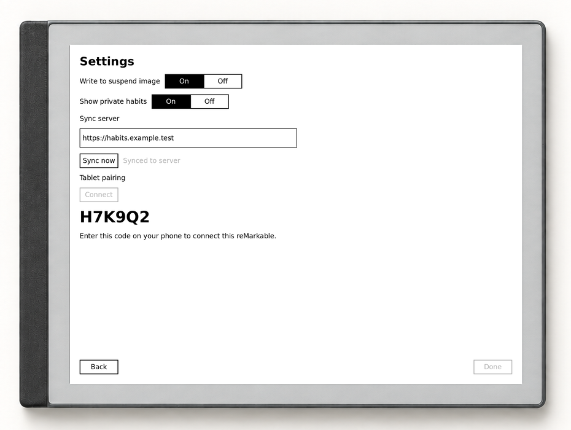
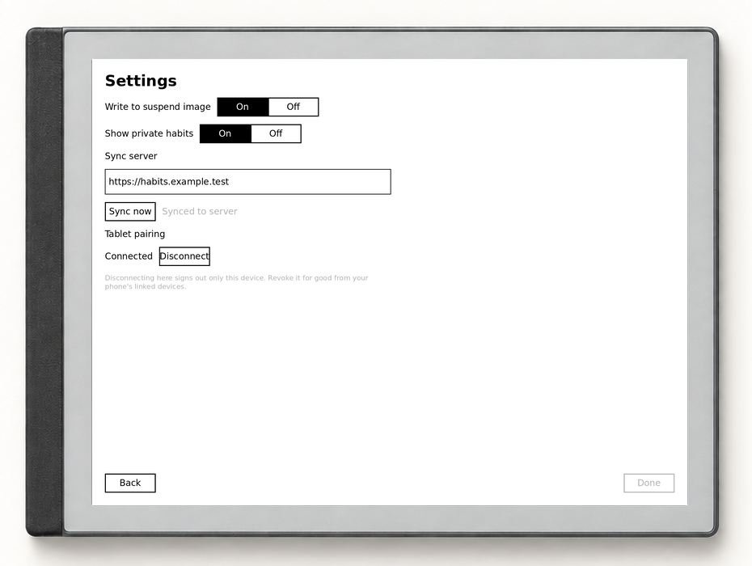
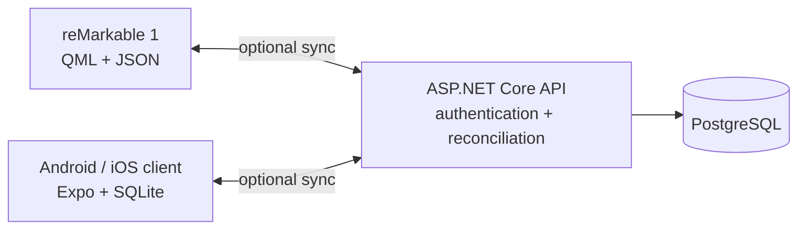

# Habit tracker for reMarkable and mobile

> An offline-first tracker that puts today's habits on your reMarkable sleep screen, with an optional mobile companion and self-hosted sync.

<table>
  <tr>
    <td width="50%"></td>
    <td width="50%"></td>
  </tr>
  <tr>
    <td align="center"><sub>Live reMarkable grid</sub></td>
    <td align="center"><sub>Generated sleep screen</sub></td>
  </tr>
</table>

The screen pixels are captures from the real reMarkable and Android interfaces, populated with
fictional sample data. A deterministic compositor fits them into the device artwork retained from
the linking concept.

This repository contains three parts of one habit-tracking system:

- A **reMarkable 1 app** built for a grayscale, distraction-free daily workflow.
- A native **mobile companion** for logging, reviewing, and managing habits on the go.
- An optional **self-hosted sync service** that reconciles both clients without making either one dependent on a network connection.

Both clients remain useful on their own. Sync is something you opt into by supplying a server address.

## Why it is different

- **The sleep screen is useful.** The reMarkable can show today's habit grid while suspended, making the tracker visible before you even open the app.
- **Offline comes first.** reMarkable stores local JSON and mobile stores local SQLite; an unavailable server never stops daily tracking.
- **Good and bad habits read naturally.** Positive habits track what you want to do, while negative habits track what you want to avoid.
- **Private habits stay off the sleep screen.** A shared privacy flag keeps selected habits out of the reMarkable suspend image; its main-grid reveal setting remains local to that device.
- **Sync has a clear owner.** Clients exchange timestamped rows and tombstones; the backend performs the last-write-wins merge and returns the authoritative result.

## Linking the devices

The reMarkable requests a short pairing code. The signed-in mobile app identifies the requesting device before approval, then lets the account owner review or revoke every linked session.

<p align="center">
  
</p>

> [!NOTE]
> The device shells below are retained AI-generated artwork. All three screen interiors are real,
> deterministic captures from the reMarkable and Android clients.

<p align="center">
  
</p>

## The reMarkable workflow

The same QML scene used on the tablet is rendered offscreen for these images; the sleep-screen
capture separately exercises the production suspend renderer. Editing and settings stay simple
enough for an e-ink display.

<table>
  <tr>
    <td width="50%"></td>
    <td width="50%"></td>
  </tr>
  <tr>
    <td align="center"><sub>Edit, reorder, and change habits</sub></td>
    <td align="center"><sub>Control privacy, suspend rendering, and sync</sub></td>
  </tr>
</table>

## The mobile workflow

The native Android captures use the same fictional fixture as the tablet and backend. They show
daily logging, month review, habit management, and the explicit sync state without contacting a
live account.

<table>
  <tr>
    <td width="50%"></td>
    <td width="50%"></td>
  </tr>
  <tr>
    <td align="center"><sub>Log today and follow streaks</sub></td>
    <td align="center"><sub>Review the month</sub></td>
  </tr>
  <tr>
    <td width="50%"></td>
    <td width="50%"></td>
  </tr>
  <tr>
    <td align="center"><sub>Manage habits and polarity</sub></td>
    <td align="center"><sub>Control account and sync state</sub></td>
  </tr>
</table>

## How it fits together



| Part                                  | Role                                                                                      | Stack                                                                  |
| ------------------------------------- | ----------------------------------------------------------------------------------------- | ---------------------------------------------------------------------- |
| [`apps/remarkable`](apps/remarkable/) | E-ink habit grid, editing, local persistence, pairing, and opt-in suspend-image rendering | QML, Qt 5.15, JavaScript, XOVI, rm-appload                             |
| [`apps/mobile`](apps/mobile/)         | Today view, streaks, month review, habit management, accounts, and linked devices         | Expo SDK 56, React Native, TypeScript, SQLite, Drizzle, TanStack Query |
| [`apps/backend`](apps/backend/)       | Authentication, pairing, canonical records, and sync reconciliation                       | ASP.NET Core 10, EF Core, PostgreSQL, OpenAPI                          |

The backend is the only cross-client contract. The two clients deliberately use storage and presentation models suited to their platforms instead of importing assumptions from one another.

## Features

### reMarkable

- Calendar grid with month navigation and today highlighting.
- Positive and negative habit semantics using simple X/O marks.
- Reorder, rename, delete, change polarity, mark private, and add habits on-device.
- Horizontal and vertical paging designed for the reMarkable 1 display.
- Optional suspend-image rendering with backup, restore, debounce, and content deduplication.
- Standalone local operation or authenticated pairing with a self-hosted sync server.

[Full reMarkable guide →](apps/remarkable/README.md)

### Mobile

- Focused Today view with progress, streaks, and slip tracking.
- Portrait month view with days as rows and habits as columns.
- Habit creation, editing, polarity changes, deletion, and drag reordering.
- Standalone mode, explicit server configuration, manual or pull-to-refresh sync, and visible sync state.
- Account signup/login, device-code approval, linked-session review, and revocation.

[Full mobile guide →](apps/mobile/README.md)

### Backend and sync

- Offline-first, one-round-trip sync with per-row edit timestamps and tombstones.
- Server-owned last-write-wins reconciliation for habits and entries.
- Opaque bearer sessions with explicit revocation rather than expiring JWTs.
- Short-lived, unambiguous pairing codes for devices without practical login forms.
- Committed OpenAPI contract used to generate and validate the mobile wire layer.

[Backend guide →](apps/backend/README.md)

## Platform status

| Target       | Status                                           |
| ------------ | ------------------------------------------------ |
| reMarkable 1 | Supported through XOVI + rm-appload              |
| Android      | Supported native client                          |
| iOS          | Build target present; not currently verified     |
| Web          | Not supported                                    |
| Sync service | Self-hosted                                      |
| Distribution | Source and internal builds; no app-store release |

## Getting started

Install the workspace dependencies once from the repository root:

```sh
pnpm install
```

### Run the mobile client

```sh
pnpm mobile:start
pnpm mobile:android
```

The mobile app can run without a backend. Add habits locally, or configure a server later from the Sync tab.

### Run the backend

The backend requires the .NET 10 SDK and Docker:

```sh
pnpm backend:db:up
pnpm backend:migrate
pnpm backend:start
```

The development API listens on `http://localhost:5137` by default.

### Install on reMarkable

The tablet client targets **reMarkable 1** and runs inside the stock UI through [XOVI](https://github.com/asivery/xovi) and [rm-appload](https://github.com/asivery/rm-appload). With that stack installed and Qt 5's resource compiler available:

```sh
cd apps/remarkable
make build
make deploy
```

Installation, SSH configuration, backups, migrations, and device-specific caveats are documented in the [reMarkable guide](apps/remarkable/README.md).

## Privacy and data ownership

- There is no telemetry.
- Both clients persist habits locally and continue working offline.
- Nothing is sent anywhere until a sync server is configured.
- The backend is self-hosted and keeps each account's records separate.
- Private habits are excluded from the reMarkable suspend image; the tablet's main-grid reveal setting stays local and never syncs.
- Session tokens can be revoked from the linked-device list without deleting local habit data.

## Engineering highlights

- The reMarkable UI is a pure-QML scene loaded into `xochitl`; it does not own the Qt process or rely on a normal desktop window system.
- A headless Qt host renders the real QML pages, while the separate suspend writer reuses the production drawing logic for sleep-screen images.
- reMarkable partitions entries into one JSON file per month, while mobile stores the backend-shaped domain in SQLite through Drizzle.
- The backend emits a committed OpenAPI document, and the mobile API client and response validators are generated from it.
- Sync treats deletion as dated data. Tombstones and client-stamped edit times let offline changes reconcile without silently resurrecting removed records.
- Architecture decisions and domain language are recorded in [`CONTEXT.md`](CONTEXT.md), per-app context files, and the reMarkable client's ADRs.

## Repository layout

```text
.
├── apps/
│   ├── backend/      ASP.NET Core API and PostgreSQL persistence
│   ├── mobile/       Expo / React Native client
│   └── remarkable/   QML client and suspend-image renderer
├── docs/             Project-level plans and README assets
├── CONTEXT.md        Shared habit-domain vocabulary
└── package.json      Workspace commands
```

## Development checks

```sh
pnpm lint
pnpm typecheck
pnpm backend:test
pnpm remarkable:test
```

The reMarkable suspend renderer has an additional host smoke test:

```sh
cd apps/remarkable
make suspend-writer-test
```

README images use a deterministic fictional fixture. The reMarkable set can be regenerated without
a tablet. Mobile uses an isolated Expo Go test project that you navigate and capture manually:

```sh
pnpm screenshots:remarkable
pnpm screenshots:frame
pnpm screenshots:linking
pnpm mobile:test:fixture
pnpm mobile:test:go
```

The standalone test APK and adb capture helpers remain available when an APK-specific capture is
needed.

[Screenshot workflow and safety contract →](tools/readme-screenshots/README.md)

## Contributing

Issues and pull requests are welcome. Start with [`CONTRIBUTING.md`](CONTRIBUTING.md) for the project boundaries, generated-code workflow, and checks expected before review.

## License

Habit Tracker is free software licensed under the [GNU Affero General Public License v3.0 or later](LICENSE). Third-party components remain under their respective licenses.
