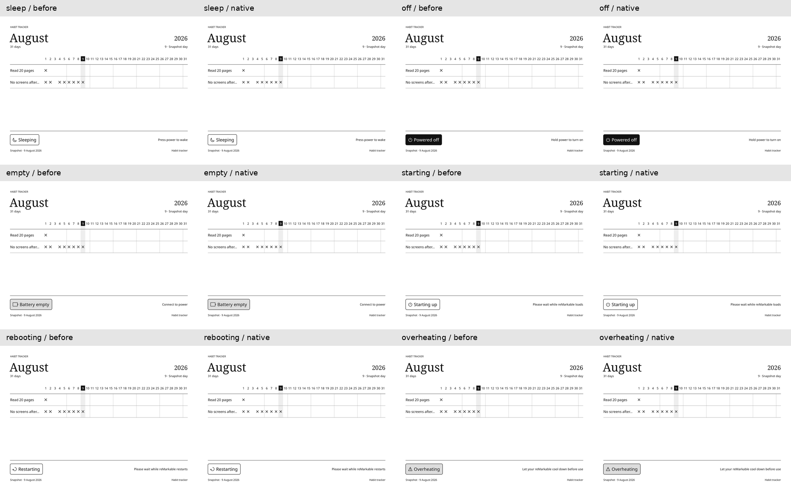

# Native rendering comparison

The paired previews compare the previous JS/QPainter bridge renderer from PR #53 with the native
renderer, using `apps/remarkable/tests/fixtures/{roster.json,2026-08.json}` at 2026-08-09. Both ran
on host Qt 5.15.19 with the same fonts. Each pair shows the previous image followed by the native
image; the contact sheet rotates portrait output for readability.

All six states preserve the grid, badge, labels, icons, and habit marks. Mean absolute channel
error over the full-resolution images is 0.020–0.022 on the 0–255 scale, reflecting small
rasterization differences. This is host evidence, not a golden-image assertion or a measurement
of tablet performance. ARM/Qt 6 builds also pass, but firmware activation, target fonts, and e-ink
appearance still require a user-run device check.
