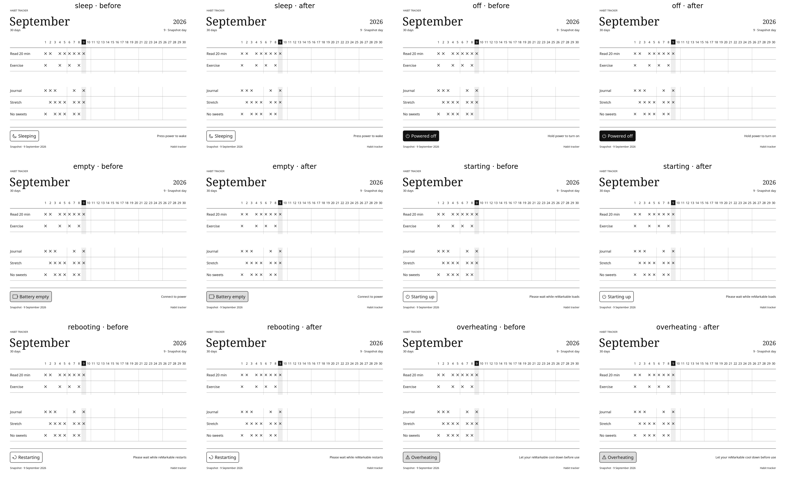
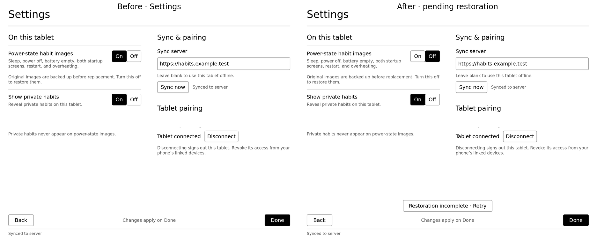

# Native rendering comparison

Run from the repository root:

```sh
pnpm screenshots:remarkable:compare -- --before-ref b7046f99c6d8e55b7e502f4fbc7a175a7aa89e9a
```

The script builds PR #53's committed JS/QPainter bridge renderer in a temporary directory and
compares it with the current native writer. Both consume the same fictional README fixture dated
2026-09-09 and run on the same host Qt 5/fonts. Portrait output is rotated for readability.



Each pair is before → after. Full-resolution images and exact baseline/measurement provenance
are in [comparison/](comparison/) and [capture.json](comparison/capture.json). The grid, labels,
icons, badges, privacy filtering, and marks preserve the design; small rasterization differences
are allowed. The readability refactor changes ownership and message plumbing, not drawing math. Comparing
against the first native commit `0918d4e9f8b5da6931be261827a4d7e0c8138d65` produced zero pixel
difference for all six states. To repeat that check without replacing the PR images:

```sh
pnpm screenshots:remarkable:compare -- --before-ref 0918d4e9f8b5da6931be261827a4d7e0c8138d65 --out-dir /tmp/native-readability-comparison
```



Settings uses explicit fixture states: enabled in the baseline, disabled with pending restoration
in the new app. This shows the recovery UI added by the PR; the process and frontend tests verify
actual failure/retry ordering. These are host captures. Target fonts, firmware activation, and
e-ink appearance still need a user-run device check.
