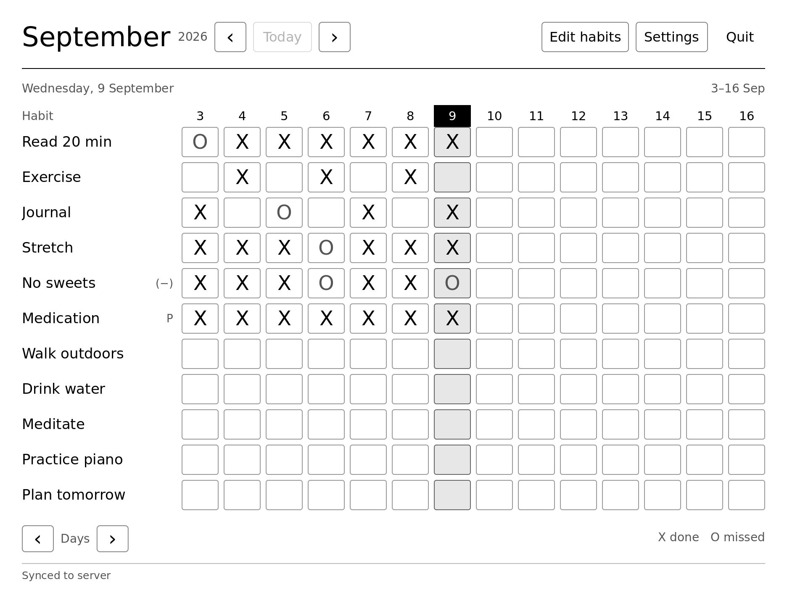

# reMarkable habit tracker

> Part of the **habit-tracker** monorepo — this is the `apps/remarkable/` client. Run the
> `make` commands below from this directory. The sibling expo client lives in `apps/mobile/`.

A small habit tracker for the **reMarkable 1** e-ink tablet. The reMarkable has no app ecosystem and no official way to run third-party software, but a community modding stack ([XOVI](https://github.com/asivery/xovi) + [rm-appload](https://github.com/asivery/rm-appload)) lets you load custom QML scenes inside the stock UI process. This is one such scene — a calendar grid of habits × days of the month (with arrows to step back and forth through months), persisted to disk, with a twist: it can overwrite the tablet's **power-state images** (sleeping, powered off, and battery empty) with today's grid, so the habits are the first thing you see when you wake the device. That overwrite is opt-in — you turn it on in **Settings**.

No account UI on the tablet itself, no telemetry. It runs fully standalone and offline by default — just a QML scene drawn by the same Qt process that already runs the device's UI. Optionally, point it at a self-hosted server (Settings → **Sync server**) to sync your habits across devices; leave it blank and nothing ever leaves the tablet. If that server requires an account, the tablet shows a QR code and a short manual code for approval from your phone (Settings → **Connect**) — it never has a login form of its own.

## What it looks like



[Roomy grid](../../docs/assets/screenshots/remarkable-grid.png) ·
[Scrolling roster](../../docs/assets/screenshots/remarkable-grid-overflow.png) ·
[Edit habits](../../docs/assets/screenshots/remarkable-edit.png) ·
[Settings and QR pairing](../../docs/assets/screenshots/remarkable-pairing.png)

These are native Qt 5.15 renders at the tablet's landscape resolution, **1872 × 1404**.

## Features

- **Calendar grid layout.** One row per habit, one column per day of the month, today's date inverted and its cells shaded gray. Rows grow from 72px to 128px as space allows, with 12px gaps. Eleven visible habits fit on the standard landscape screen; larger rosters keep readable rows and enable page scrolling. Horizontal `‹` / `›` buttons scroll a week at a time when the month doesn't fit; the view opens centered on today. Vertical `↑` / `↓` buttons scroll a page of habits at a time when the list is taller than the screen; the day-of-month header stays fixed while the rows scroll. The grid builds asynchronously on launch — until it's ready a `Loading…` placeholder fills its place and the `‹` / `›` buttons stay disabled.
- **Month navigation.** `‹` / `›` arrows either side of the month header step back and forth through months — unbounded in both directions, so you can review any past month or peek ahead. Any month is fully editable: tap cells to backfill a month you never tracked (its file is written lazily, only once you mark something). Only the current month highlights today and feeds the power-state images; other months show no highlight. The **Today** button jumps straight back from another month. Switching months shows the same `Loading…` screen as first open while the grid rebuilds; the month arrows stay live so you can keep hopping.
- **Two habit modes.**
    - _Positive_ habits cycle empty → X → O → empty. X = done, O = explicitly not done.
    - _Negative_ habits invert it: every day is implicitly X ("didn't slip up today"), tap to flip to O when you do slip. Future days render muted and the name carries a `(−)` suffix.
- **Private habits.** The editor's **Public / Private** button marks a habit private. Private habits never appear on power-state images and stay out of the grid unless **Show private habits** is on in Settings. A row made private during editing remains visible until **Done** applies the changes. Existing private habits must be revealed in Settings before editing them. The private flag syncs; the reveal setting stays local.
- **Power-state images (opt-in).** **Power-state habit images** in Settings draws the Quiet ledger layout on the suspend, power-off, and battery-empty images, plus startup, restart, overheating, and crash-recovery images where available, always excluding private habits. A compact icon, state label, and instruction distinguish each state. All selected originals are backed up before any image is replaced; disabling restores them. Existing backups are preserved. The date is explicitly a snapshot, not a live clock.
- **Settings.** A two-column settings page (button next to **Quit**) with the power-state-image-writing `On` / `Off` toggle, a **Show private habits** `On` / `Off` toggle, and a **Sync server** address field. Changes are staged and applied on **Done**, which returns to the grid and runs the backup/restore — its progress shows in the grid's status line. **Back** discards staged changes (with a confirmation if you've changed anything).
- **Optional offline-first sync.** Leave the **Sync server** blank and the app is fully local. Enter a server address and it syncs your roster and the month you're viewing with that server — on open, whenever you navigate to a month, a few seconds after edits, and via a **Sync now** button. Conflicts resolve last-write-wins per habit and per day; deletes propagate as tombstones. It's offline-tolerant: when the server is unreachable you keep working and a quiet status line (alongside the power-state image status) counts the debounce down ("Syncing in 3s" → "Syncing…"), tracks the request as it runs ("Connecting…" → "Receiving…"), and then shows the outcome ("Synced to server" / "Sync failed: offline" / "Not connected" once paired if the server no longer recognises the token — never a lost habit, just a status line to fix in Settings).
- **Tablet pairing.** Syncing against an authenticated server needs this device to hold a bearer token — there's no account UI here, by design. Settings → **Connect** requests a short pairing code from the server and displays it beside a high-contrast QR code. Scan it from the phone's linked-devices flow, or enter the same code manually, review the requesting device, and approve it; the tablet stores the token on its next poll. The code is unambiguous on purpose (no `0`/`O`/`1`/`I`) and expires after 5 minutes; polling only happens while the Settings page is open, so it never runs unattended. **Disconnect** drops the token from this device only — revoke it for good from the phone.
- **In-app editing.** Reorder, rename, delete, toggle positive/negative, toggle private, add new habits — all from the device. Changes stay in a draft until **Done**; **Cancel** discards them after confirmation. **Negative** and **Private** buttons invert to show their state.
- **Local persistence.** Habit data lives under a `data/` folder on the device: `roster.json` (the habit list + config) plus one `YYYY-MM.json` per month (that month's entries, one row per marked day); `sync.json` holds sync bookkeeping. App preferences stay in `settings.json`. A single tap rewrites only the current month, not all of history. Saves fail loudly — if `data/` is missing, a dialog says so rather than dropping your entries silently. The app reads exactly one storage format and refuses anything else: a file it can't read is never treated as empty, so nothing gets overwritten by the next tap. Format changes are handled by a script you run on your computer, not by the app (see [Upgrading across a storage-format change](#upgrading-across-a-storage-format-change)).

## Install

You need a **reMarkable 1** (this targets Qt 5.15 specifically — it doesn't run on rM2). Because the device doesn't let you sideload apps natively, install the community stack first:

1. **XOVI** — a function-hooking framework for xochitl. See [`asivery/xovi`](https://github.com/asivery/xovi).
2. **rm-appload** — an XOVI extension that adds an app launcher. See [`asivery/rm-appload`](https://github.com/asivery/rm-appload).

Then build and deploy this app:

```sh
make build      # produces build/resources.rcc + staged icon/manifest
make deploy     # scps build/* to /home/root/xovi/exthome/appload/habit-tracker/
```

(`make deploy` needs `ssh remarkable` to resolve to the tablet — set it up in `~/.ssh/config`, or use `make REMARKABLE_HOST=<host> deploy`. If the tablet's address moves — a phone hotspot re-leases every session — `make find-hotspot-ip` locates it and updates the config; see [below](#finding-the-tablet-after-its-address-changes).)

On the tablet, hold the middle button for ~3 seconds to open apploader, then tap the **reMarkable habit tracker** tile.

## Daily use

- **Tap a cell** to cycle its state.
- **`‹` / `›` beside the month title** move to the previous / next month; **Today** jumps back. Editing works in any month, so you can backfill a month you missed.
- **Edit habits** (top-right) opens a separate editor. Rename, reorder with `↑` / `↓`, delete with `×`, and toggle **Positive / Negative** or **Public / Private**. The add row stays below the scrolling list; tap `+` or press Enter to add a habit to the draft. Reorder arrows skip habits hidden by the privacy setting.
- **Done** applies all habit edits and returns to tracking. Newly private rows disappear only now if **Show private habits** is off. **Cancel** discards the draft after confirmation.
- **Settings** (top-right, left of Quit) opens the settings page. Toggle power-state-image writing `On` / `Off`, toggle **Show private habits** `On` / `Off`, and/or type a **Sync server** address (e.g. `http://192.168.1.50:5137`; blank = offline). **Done** applies and returns to the grid — enabling power-state-image writing backs up every selected original and starts drawing the grid there; disabling restores the backups; a non-blank server triggers a sync. **Sync now** forces an immediate sync. **Back** returns without applying. If the server requires an account, **Connect** (under **Tablet pairing**, enabled once a server address is set) shows a QR code and its short manual code — scan either way from your phone to approve this device; **Disconnect** signs it out locally.
- **Quit** (top-right) unloads the app and restores the normal xochitl UI.

State is saved under `/home/root/xovi/exthome/appload/habit-tracker/data/` — `roster.json` plus a `YYYY-MM.json` per month. First launch seeds the roster from the defaults in `src/js/habits.js`. The `data/` folder must exist (the deploy creates it); if it's missing, saves surface a visible error instead of failing silently. Back up before resetting or removing the app; deleting local files removes local history and does not delete the server's copy.

A habit is stored as `{ id, name, polarity, isPrivate, createdAt, editedAt, deletedAt }` and a month as `{ "month": "2026-07", "entries": [ { habitId, date, outcome, editedAt, deletedAt }, … ] }` — the same row shape the sync server speaks, so the only thing translated on the way out is the X/O mark, which the server calls `Success` / `Failure`. Files written in an older shape are refused, not converted: see [Upgrading across a storage-format change](#upgrading-across-a-storage-format-change).

## Connect to the sync service

1. Set up the [backend](../backend/README.md#run-it) and sign in on mobile. The included backend
   requires authentication for all habit and sync requests.
2. In tablet **Settings**, enter the server's base URL (without `/api/sync`) and apply it with
   **Done**. For local development, use the computer's LAN address, such as
   `http://192.168.1.50:5137`; `localhost` would refer to the tablet itself.
3. Reopen **Settings → Connect**, then use mobile's **Sync → Linked devices → Link a device**
   to scan or enter the code and approve the requesting tablet.
4. Keep Settings open until the tablet receives its token, then use **Sync now**. If the code
   expires after five minutes, request a new one.

Sync includes the roster and the month currently being viewed. Visit each older month you want to
upload or retrieve; a single sync does not transfer the tablet's entire history. **Disconnect**
removes this tablet's token locally. To revoke its server session, use mobile's **Linked devices**.

## Backups, upgrades, and removal

Close the app with **Quit** before backing up so pending saves reach disk. From this directory:

```sh
make backup     # copies data/ into .backup/<timestamp>/ on your computer
```

This includes the roster, month files, and sync bookkeeping. It does **not** include the app's
`settings.json` (preferences and pairing token) or the system power-state image backups. Keep
the backup directory somewhere safe. Sync propagates deletions and is not a substitute for a backup.

For a normal stable update, close the app and run `make deploy`; it replaces
application assets while preserving data and settings. If the storage format changed, follow the
[migration procedure](#upgrading-across-a-storage-format-change) first.

Before uninstalling the stable app, turn **Power-state habit images** **Off** and apply with
**Done**. Wait for all selected original images to be restored successfully, then quit and back up.
`make remove` deletes the entire installed app directory, **including local data and settings**,
and does not restore the power-state images or revoke the server session. Revoke that session
separately from mobile if retiring the tablet.

For test installs, use `make backup-test` and `make remove-test`. If you used **Write suspend
image once**, restore the original from **Settings → Developer options** before removing the
test install; its backup lives inside that directory. See
[Testing alongside your working app](#testing-alongside-your-working-app).

### Troubleshooting

| Symptom                          | What to check                                                                                                                                                                |
| -------------------------------- | ---------------------------------------------------------------------------------------------------------------------------------------------------------------------------- |
| Sync fails offline               | Confirm the server URL, network connection, and backend availability. Local tracking still works.                                                                            |
| Not connected                    | Pair again; the server may have revoked the token or lost its sessions.                                                                                                      |
| A private habit disappeared      | Enable **Show private habits** in Settings and apply with **Done** before editing it.                                                                                        |
| Power-state images look stale    | Enable **Power-state habit images** and return to the current month. Other months do not update them. Wait for **Power-state images saved** before sleeping or powering off. |
| Storage file is refused          | Keep the original file and backup. Follow the relevant migration; deleting it to silence the error would discard data.                                                       |
| Saves report a missing directory | Deployment creates `data/`. Check the installed path before continuing to enter data; unsaved changes remain only in memory.                                                 |

## How it's built

The reMarkable 1 runs **xochitl**, the stock UI, which is itself a Qt 5.15 application. The community modding stack hooks into it:

- **XOVI** loads native extensions into xochitl.
- **rm-appload** is one such extension: it overlays a launcher on top of xochitl and runs each "app" as a QML scene inside xochitl's own Qt process. The frontend runtime it exposes is plain QML — no Wayland, no X, no framebuffer driver, no separate process.

This app is the QML scene. It's packaged as a Qt binary resource (`.rcc`) plus a small manifest and icon; deploy is `scp` of three files into apploader's directory on the device.

| Layer       | What                                                                 |
| ----------- | -------------------------------------------------------------------- |
| Hardware    | reMarkable 1 (e-ink, ARM, Linux-based firmware)                      |
| Stock UI    | xochitl (Qt 5.15 process)                                            |
| Hooking     | XOVI                                                                 |
| App runtime | rm-appload (XOVI extension, QML frontend host)                       |
| This app    | `Main.qml` + a `Theme` singleton, small components, plain JS helpers |
| Build       | `rcc-qt5 --binary` → `resources.rcc`                                 |
| Deploy      | `scp` to `/home/root/xovi/exthome/appload/habit-tracker/`            |

### Interesting bits

**Power-state-image rendering.** The app draws 1404×1872 PNGs from one current-month snapshot into the following files in `/usr/share/remarkable/`:

| File                  | State label   | Instruction                              |
| --------------------- | ------------- | ---------------------------------------- |
| `suspended.png`       | Sleeping      | Press power to wake                      |
| `poweroff.png`        | Powered off   | Hold power to turn on                    |
| `batteryempty.png`    | Battery empty | Connect to power                         |
| `starting.png`        | Starting up   | Please wait while reMarkable loads       |
| `rebooting.png`       | Restarting    | Please wait while reMarkable restarts    |
| `overheating.png`     | Overheating   | Let your reMarkable cool down before use |
| `restart-crashed.png` | Restarting    | Please wait while reMarkable restarts    |

[Preview startup, restart, and overheating images](../../docs/assets/screenshots/remarkable-power-states.png).

The four additional images are included when their original or backup can be read; absent files are not created just to support a different firmware version. Crash recovery deliberately renders the same image as rebooting: [some firmware makes `restart-crashed.png` a symlink to `rebooting.png`](https://remarkable.jms1.info/info/filesystem.html#splash-screens), so a different crash footer would also overwrite the normal restart footer.

Each contains the landscape Quiet ledger layout and a state icon and instruction. The icon and regular-weight sans-serif label sit in a softly rounded badge with generous vertical padding. Sleeping uses a white badge with a black outline, powered off uses a black badge with white content, and battery empty and overheating use a gray badge with a black outline. Startup and restart use white outlined badges with power and restart icons. The rest of every screen stays white. Icons align with the label's visible height, with a compact gap; the battery is wider to retain that same height. No O marks are added, matching the previous suspend renderer. Long names are ellipsized, and larger rosters use tighter rows to keep the state footer clear.

All originals must be readable and backed up to their adjacent `.bak` files before the first write. Existing backups are reused, including the original suspend backup on upgrade. Backup, restore, and save failures name the affected path. Disabling preflights every backup, restores every selected image, then commits the setting off; a failed restore pauses further rendering until retried. Uninstalling does not restore images: disable the feature successfully first. An already-enabled suspend setting now covers all available images, without changing the persisted settings shape. The render signature changes on upgrade and includes the selected paths so newly supported screens are rendered even when the habit data is unchanged.

**Startup versus early boot.** `starting.png` is [documented as the loading screen](https://xavier.arnaus.net/blog/remarkable-2-customizing-screens); this is the likely source of “Paper tablet is loading”, but the exact wording still needs checking on the device's firmware. Firmware may draw its own progress indicator over the image. Automatic renders replace the PNG background, not that overlay. The earlier “Paper tablet is starting” image on reMarkable 1 comes from a separate bootloader BMP; use the test build’s **Developer options → Write all screens once** to replace it as described below. It leaves first-use `factory.png`, firmware-update artwork, and release-note artwork alone. OS updates can restore stock images; reopen the app and check the power-state-image status after updating.

To confirm the installed files and aliases, run this yourself (agents must not access the device):

```sh
ssh remarkable 'ls -l /usr/share/remarkable/*.png /usr/share/remarkable/splash/splash.* /var/lib/uboot/splash.* 2>/dev/null'
```

After installing, check startup and restart on the tablet, including any firmware progress overlay. The host previews cannot verify which screen a particular firmware displays or caches.

The images are prepared while the app is running; battery depletion does not need to launch the renderer. All outputs are dated snapshots and stay unchanged while the tablet is off. Device firmware activation and e-ink appearance still need checking on the tablet after deployment.

**Cheap re-renders.** Saving a 1404×1872 PNG for every trivial edit is wasteful, so renders are _debounced_ (a 3-second timer restarts after saved changes) and _deduplicated_ via a content signature persisted alongside the PNG — if nothing visible changed, nothing is written. A small status line on the grid ("Saving power-state images in 3s" → "Power-state images saved", and the backup/restore phases) makes the pipeline visible. Quit waits for the latest image batch and backup operations. Unloading can synchronously save only after backups have been prepared; it never bypasses backup safety. The content signature includes the layout version and is committed only when every selected save succeeds, so a partial failure is retried.

**Pure QML + plain JS.** State lives in JSON-backed QML stores sharing a `JsonStore.qml` base for the load/debounced-save plumbing. `HabitsStore.qml` is a facade that splits persistence across two files — a `roster.json` (identity + config, plus tombstones for deleted habits) and a per-month file holding that month's entries as flat `(habitId, date)` rows — so a single toggle rewrites only the current month, not all history, and corruption is isolated to one month. The rows match the backend's shape exactly while the month partitioning keeps launch and per-tap cost bounded to one month, which matters on a 1 GHz device. Components forward signals upward; only the store mutates state. Updates are immutable (array spread, `Object.assign`) — the V4 engine handles re-bindings from there. Optional sync is a separate `SyncStore.qml` (the network engine + a `sync.json` sidecar) over a pure-JS `Sync.js` translation layer, sending `Authorization: Bearer <token>` once paired; the merge itself runs server-side, so the client just sends its state and accepts the authoritative result. Tablet pairing is `PairingStore.qml` (ephemeral — nothing it holds persists) over a pure-JS `Pairing.js` translation layer. Both stores share `ServerUrl.js`'s scheme-defaulting/endpoint-joining and `HttpError.js`, which displays the backend's `ProblemDetails.title` for server rejections; the stores only supply messages for device-side network and response failures.

**Platform constraints shape the code.**

- _ES2016 / Qt 5.15 V4 engine._ No `async`/`await`, no optional chaining, no object spread. The codebase targets ES2016 deliberately and the project's `CLAUDE.md` captures the rule for future contributors (human or AI).
- _Grayscale e-ink, 16 levels._ Color renders as washed-out mid-grays; white is invisible against the paper-white background. The UI is strict black-on-white with weight, borders, and inversion as the only emphasis tools.
- _Portrait display, landscape layout._ `Main.qml` wraps the scene in an `Item { rotation: 90 }` with `width` and `height` swapped, so the rest of the QML reads as a normal landscape layout.

## Building from source

### Testing alongside your working app

From the worktree containing the feature you want to test, run these at the monorepo root:

```sh
pnpm remarkable:build:test       # local build only
pnpm remarkable:deploy:test      # user-run: install Habit Tracker TEST on the tablet
pnpm remarkable:backup:test      # user-run: copy test habits to apps/remarkable/.backup/test/<timestamp>/
```

Or use `make build-test`, `make deploy-test`, and `make backup-test` from `apps/remarkable`.
Close **Habit Tracker TEST** before deploying it again, then reopen that launcher entry. Your
ordinary app remains installed. These commands always use `habit-tracker-test`, including from a
feature worktree; the test and stable bundles have separate local build directories too.

The test install keeps its roster, month files, sync state, settings, and pairing token under
`/home/root/xovi/exthome/appload/habit-tracker-test/`. First launch uses default habits and blank
server/token settings. Deploying copies only the app bundle, manifest, and icon; it never copies
production data or credentials, and later deploys preserve existing test data. There is one shared
test slot on the tablet, so deploying another worktree replaces that test version.

The grid and Settings display **TEST**. Ordinary test writes stay inside the test app directory,
including when **Save local suspend preview** is enabled: automatic renders, edits, and quitting only
update `suspend-preview.png`. Only explicit developer write/restore actions change device power-state images.
Test builds refuse writes to production habit data, settings, and the
stable suspend-image backup. The separate native device suspend-writer is unavailable in the test
profile. Both apps run inside xochitl; this is not an operating-system sandbox. Keep the test
directory as a normal directory, without symlinks to production files.

#### Developer options (test builds only)

From the current month's grid, open **Settings → Developer options**. Apply or discard staged
settings before opening it. The page shows the test data, preview, and backup paths and offers:

- **Render preview** regenerates `developer-preview.png` once, even if nothing changed. It leaves the
  device's suspend image alone and works with automatic previews switched off.
- **Write suspend image once** renders the current month's test habits and writes the device's
  actual suspend image for this one button press. It never enables automatic device-image writes.
  The first write saves and verifies the existing image as `device-suspend-original.png` inside
  the test install before changing the device image. Later writes and app restarts preserve it.
- **Restore original image** copies that verified original back, even when viewing another month
  or when habit data cannot be read. Restore before removing the test install, which holds the
  backup. The original is the image captured before the **first** test write, not necessarily the
  stock reMarkable image or the latest stable habit grid.
- **Write all screens once** renders one current-month snapshot for every available supported
  screen: sleep, power off, battery empty, startup, restart, overheating, crash recovery, and
  reMarkable 1 early boot.
  All previews are saved locally and all originals are backed up and verified before any system
  image is replaced. This is a one-shot action; automatic renders continue to write local previews only.
  Additional originals are kept as `device-<screen>-original.png` in the test install. The suspend
  image shares the existing `device-suspend-original.png` backup with the single-image action.
  On `reMarkable 1.0`, this also replaces both existing `/usr/share/remarkable/splash/splash.bmp`
  and `/var/lib/uboot/splash.bmp` with the starting snapshot. The bootloader reads the latter;
  the former is an identical copy on the inspected tablet, but its runtime role is unconfirmed.
  Originals and generated previews must match the verified 1872×1404, uncompressed 8-bit BMP
  layout; another device model or unexpected BMP stops the whole batch before any system writes.
  Separate backups are `device-system-splash-original.bmp` and `device-boot-splash-original.bmp`.
  Boot images refresh only on this explicit action. Keep the tablet on until it reports completion;
  the boot-partition write is verified by readback but is not atomic against power loss.
  See [bootloader evidence and BMP requirements](docs/research/early-boot-splash.md).
- **Restore all original screens** preflights every captured backup before restoring it, including
  after an interrupted or partially failed batch. It works without readable/current-month habit data.
  Repeated writes and app restarts preserve the first verified originals; restore before uninstalling.

[Developer-options preview](../../docs/assets/screenshots/remarkable-developer-options.png).

The developer UI, controller, and their own preview renderer live under `src/testing/`, behind
`DeveloperTools.qml`. The app passes only the habit model, render eligibility, and data directory;
the module handles its actions internally. Stable bundles omit every `src/testing/` resource.
The ordinary suspend renderer exposes reusable one-shot and batch preview operations. The developer
controller permits explicit device writes only to the supported screen paths; ordinary test storage
and preview rendering still refuse writes outside the test app directory.

Render actions require readable, loaded data for the current month. Private habits remain excluded.
Failures are displayed on the developer page; a failed render or backup never proceeds to a device
write. Device-write failures name the affected path; originals remain available for restoration.
Close the stable app during screen testing, since it can otherwise replace the shared device images
with its own grid. The test app never changes the stable app's backup or signature.

**Sync requires separate test data on both clients.** For pairing tests, use a separate backend
account (or a separate backend), and a phone installation with separate local storage. A real
account on either test client can sync test edits into real habits, even though tablet files are
separate. Signing out of an existing phone app does not isolate the habits it already has locally.
The tablet starts disconnected, but remembers the test server and token after you pair it.

For device pairing: configure the same test server on both clients, sign in on the test phone app,
then choose **Connect** in the tablet's test Settings. Enter its code and approve it from the phone's
**Linked devices → Link a device** screen. Features added on other branches, such as QR scanning,
can use the same test-install workflow once those changes are present in the worktree.

To update the stable app, close it and run:

```sh
make deploy
```

From the monorepo root, use `pnpm remarkable:deploy`. Back up stable habits with
`pnpm remarkable:backup` before a stable upgrade. Existing unreadable-file protection remains in
place: incompatible or corrupt habit files block saves and sync.

### Build tools

You need Node.js to stage the build profile and Qt 5's `rcc` to match the app's Qt 5.15 runtime:

- Arch/Manjaro: `pacman -S qt5-base` (binary is `rcc-qt5`)
- Debian/Ubuntu: `apt install qtbase5-dev-tools`
- macOS: `brew install qt@5`

Override the binary with `make RCC=<path>` if it isn't on `$PATH` as `rcc-qt5`.

```sh
make build      # produces build/resources.rcc + staged icon/manifest
make test       # runs the test suite (see below)
make deploy     # scps build/* to the device
make remove     # uninstalls from the device
make backup     # pulls the device's data/ into a timestamped .backup/ dir
make find-hotspot-ip  # relocates the tablet on the current network (see below)
make clean      # nukes local build/
```

### Tests

```sh
make test                  # Qt Quick Test over tests/tst_*.qml
make suspend-writer-test   # smoke-tests the off-device renderer against tests/fixtures/
```

`make test` needs `qmltestrunner-qt5` (Arch/Manjaro: `pacman -S qt5-declarative`; Debian/Ubuntu:
`apt install qtdeclarative5-dev-tools`), and runs headless against the sources in `src/` — no build
step first. It covers the plain-JS modules (the sync and pairing wire formats, the outcome cycles,
the date and scroll helpers, the suspend-image signature) and the QML stores (debounced saving, the
refusal of unreadable files, month navigation, the sync engine's terminal paths including a 401, and
the pairing flow's poll-status handling). Override the runner with `make QMLTESTRUNNER=<path>`.

`make suspend-writer-test` additionally needs a host C++ toolchain and Qt 5 dev headers, since it
builds `tools/suspend-writer` first.

### Finding the tablet after its address changes

A phone hotspot hands out a new lease every session, so the `remarkable-hotspot` entry in
`~/.ssh/config` goes stale. `make find-hotspot-ip` scans the network you are on, identifies the
tablet by its **SSH host key** — the key survives lease changes, so a fingerprint already in
`known_hosts` under one of your `remarkable` hosts is proof rather than a guess — and rewrites that
entry's `Hostname`, keeping the old file as `~/.ssh/config.bak`.

```sh
make find-hotspot-ip                             # repoint the remarkable-hotspot entry
make find-hotspot-ip HOTSPOT_HOST=remarkable     # repoint a different ssh-config host
pnpm remarkable:find-hotspot-ip                  # same, from the monorepo root
tools/find-remarkable-hotspot-ip.sh <ssh-host>   # same, without make
```

Requires `nmap`, and runs it under `sudo` (so expect a password prompt): host discovery needs root
to use ARP, and an unprivileged `nmap -sn` degrades to a TCP connect sweep that never sees the
tablet, which answers on no port but SSH. It only ever acts on an unambiguous match: no match, or
more than one, and it prints what it saw and changes nothing. Two matches means `known_hosts` still
vouches for an address that has since changed hands — clear that entry with `ssh-keygen -R <addr>`.
The first connection on a new address files the key under it too, so the next hotspot is recognised
without any state of its own.

## Upgrading across a storage-format change

The app only ever reads one storage format — it carries no migration code, by design
([ADR 0006](docs/adr/0006-external-one-shot-migrations.md)). When a release changes the format, it
ships a one-shot script in `scripts/` that you run on your computer against a backup of the device's
data.

**Close the app on the device first** and leave it closed until the last step. An old build on new
data is as broken as a new build on old data, and a running app flushes its in-memory state on quit —
straight over whatever you just pushed.

```sh
make backup                                    # pulls data/ into .backup/<timestamp>/
node scripts/<the-migration-script>.mjs .backup/<timestamp> /tmp/migrated
```

The script writes to a fresh directory and never touches the device or your backup. It prints what it
did — habits in/out, entries per month in/out, anything it dropped — and re-reads its own output to
confirm the counts before reporting success. Check those numbers look like your data, then push it
back and deploy:

```sh
rsync -avz /tmp/migrated/ remarkable:/home/root/xovi/exthome/appload/habit-tracker/data/
make deploy
```

Then reopen the app. If you get the order wrong, nothing is lost: the new build refuses files it
can't read, blocks saves and sync, and tells you which file is the problem — fix it and reopen.

**Current migration: private habits.** The habit-private-flag change (ADR 0008) ships
`scripts/migrate-is-private.mjs`, which renames each roster row's `hideFromSleep` to `isPrivate` and
leaves the month files untouched — run it as `<the-migration-script>.mjs` above. This migration also
**requires rebuilding and redeploying `tools/suspend-writer`** (`make suspend-writer-device` then
`make suspend-writer-deploy`) before you reopen the app: an un-rebuilt suspend-writer binary reads the
migrated roster's absent `hideFromSleep` as false and would draw private habits on the lock screen. Do
this before the final `make deploy` above, not after.

## Repo layout

```
.
├── application.qrc      # files bundled into the .rcc
├── manifest.json        # apploader manifest (id, display name, entry path)
├── icon.png             # launcher icon
├── Makefile             # build / deploy / remove / clean
├── src/
│   ├── Main.qml         # entry; root declares signal close + unloading()
│   ├── Theme.qml        # singleton: sizes, fonts, colors
│   ├── JsonStore.qml    # base: deferred load + debounced save for the stores
│   ├── HabitsStore.qml  # facade: roster + per-month entry files, sole source of mutation
│   ├── SettingsStore.qml# JSON-backed app settings (power-state images on/off, sync server URL, bearer token)
│   ├── SyncStore.qml    # offline-first sync engine + sidecar (last-synced time)
│   ├── PairingStore.qml # tablet device-code pairing (Connect flow); ephemeral, nothing persists
│   ├── components/      # reusable QML pieces (AppButton, HabitsGrid, SuspendCanvas, SettingsPage, …)
│   └── js/              # plain JS modules (date helpers, scroll math, suspend-image draw, sync translation)
├── scripts/             # one-shot storage migrations, run on your computer (see ADR 0006)
├── docs/adr/            # the decisions behind the storage layout, suspend image and migrations
└── build/               # rcc output + deploy staging (gitignored)
```

## Development notes

apploader runs inside xochitl, so QML parse errors and `console.log()` output land in xochitl's stderr → systemd journal:

```sh
ssh remarkable journalctl -fu xochitl --no-pager
```

apploader prefixes its messages with `[AppLoad]:` / `[QTFB]:`. `[QTFB]: Unregistered framebuffer controller ID: -1` is harmless for QML-only apps.

### Platform gotchas worth knowing before editing

1. **QML files must live inside the `.rcc`.** Loose `.qml` files on the device aren't found. Add new files to `<qresource>` in `application.qrc` (and to the relevant `qmldir`) and rebuild.
2. **`entry` in `manifest.json` must start with `/`.** apploader concatenates the entry onto `qrc:/<nonce>` with no separator; without the leading slash you get `qrc:/NONCEMain.qml` and "No such file."
3. **Root QML conventions.** The root must declare `signal close` and `function unloading() { ... }`. Emit `close()` from the Quit handler — `Qt.quit()` is a no-op (the Qt process is xochitl, you don't own it).
4. **No hardcoded root size.** apploader sizes the container; use `anchors.fill: parent`. Hardcoded `width: 1404; height: 1872` is silently ignored.
