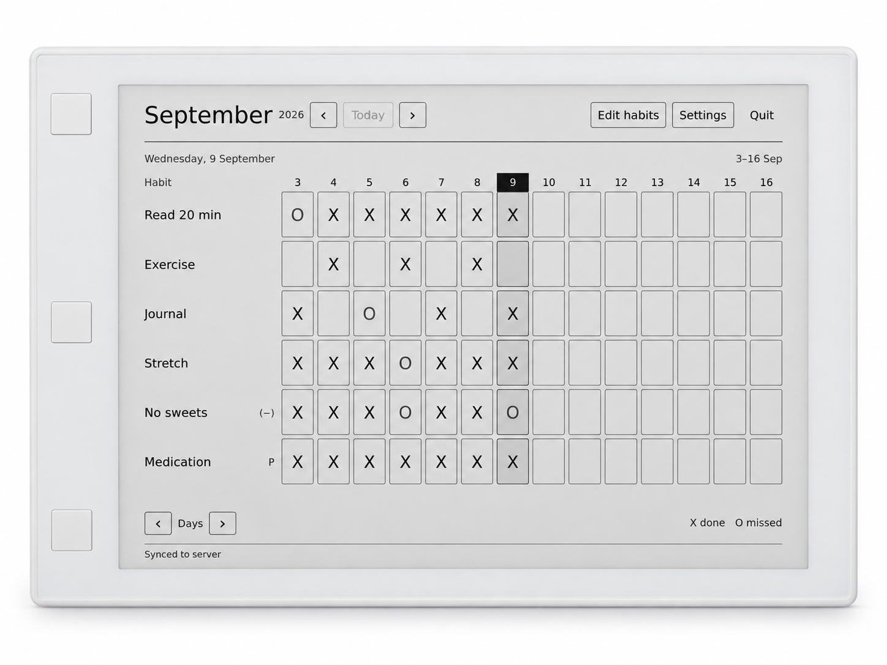
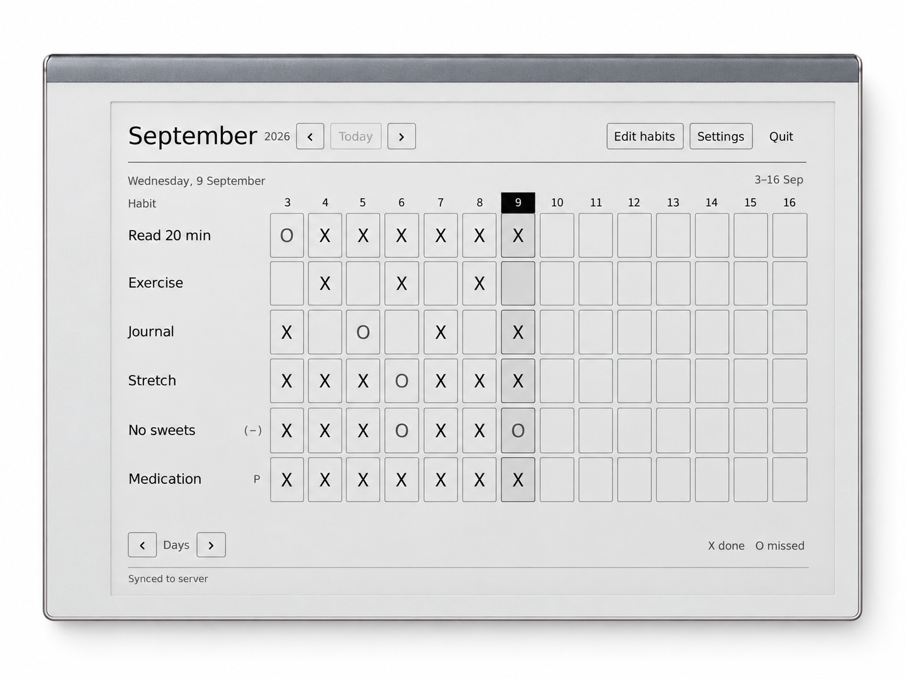
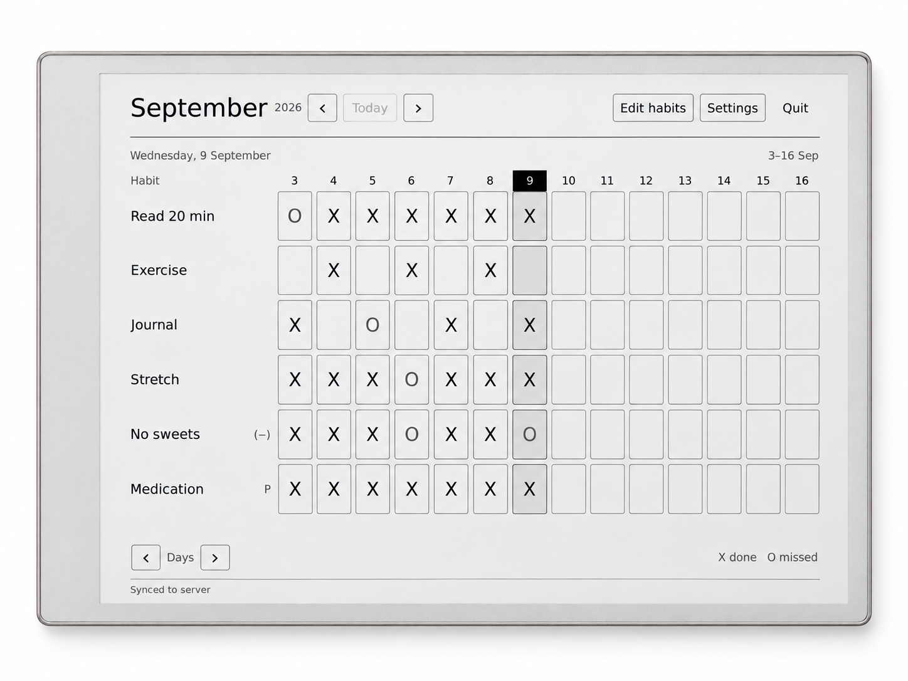

# reMarkable screenshot frame concepts

Generated with the built-in imagegen tool. These are design previews; screenshot pixels are synthesized, so the chosen frame should be integrated with the original screenshot via the existing compositor before publishing.

Hardware references:
- [reMarkable 1 photograph](https://www.ebay.com/itm/146892029187)
- [Official reMarkable 2 / Paper Pro comparison](https://remarkable.com/clp/remarkable-paper-pro-vs-remarkable-2)

## 1. remarkable-1

Prompt:

Use case: compositing. Create a beautiful but hardware-faithful screenshot mockup of the specified REAL reMarkable tablet. Input 1 is the screen insert: preserve this exact habit-tracker screenshot, all text, marks, spacing and full 4:3 content. Input 2 is the actual hardware reference, use its real silhouette, bezel widths, materials and controls, not an invented tablet. Rotate the physical portrait tablet 90 degrees CLOCKWISE into landscape, but the inserted app screenshot stays upright landscape. Perfectly straight-on front view with zero perspective. Pure white background. Frame fills most of the canvas with 4% whitespace, crisp precise edges, soft restrained studio shadow, professional README product imagery. Single tablet only, no stylus, hands, folio, labels, captions, additional words or props. Do not copy any reference image screen content. Model reMarkable 1. White plastic body, modest rounded outer corners, square screen corners, generous white bezels. Exactly THREE widely spaced small square physical buttons along the LEFT short edge in landscape: one near its upper end, one at center, one near lower end, matching the reference after rotation. Do not cluster the buttons in the middle. No dark spine, no metallic bezel. Bright clean rendition of the original white hardware, with subtle depth.

## 2. remarkable-2

Prompt:

Use case: compositing. Create a beautiful but hardware-faithful screenshot mockup of the specified REAL reMarkable tablet. Input 1 is the screen insert: preserve this exact habit-tracker screenshot, all text, marks, spacing and full 4:3 content. Input 2 is the actual hardware reference, use its real silhouette, bezel widths, materials and controls, not an invented tablet. Rotate the physical portrait tablet 90 degrees CLOCKWISE into landscape, but the inserted app screenshot stays upright landscape. Perfectly straight-on front view with zero perspective. Pure white background. Frame fills most of the canvas with 4% whitespace, crisp precise edges, soft restrained studio shadow, professional README product imagery. Single tablet only, no stylus, hands, folio, labels, captions, additional words or props. Do not copy any reference image screen content. Model reMarkable 2, the REAR device in reference image 2, NOT the front Paper Pro. White/light gray bezel and thin satin silver outer body. Its characteristic darker gray metal spine runs along the TOP LONG edge in this clockwise-rotated landscape view, not the left short edge. Original portrait bottom chin becomes the wider LEFT short bezel. No front physical buttons, no camera, no black leather. Accurate proportions and subtle tiny corner radii.

## 3. remarkable-paper-pro

Prompt:

Use case: compositing. Create a beautiful but hardware-faithful screenshot mockup of the specified REAL reMarkable tablet. Input 1 is the screen insert: preserve this exact habit-tracker screenshot, all text, marks, spacing and full 4:3 content. Input 2 is the actual hardware reference, use its real silhouette, bezel widths, materials and controls, not an invented tablet. Rotate the physical portrait tablet 90 degrees CLOCKWISE into landscape, but the inserted app screenshot stays upright landscape. Perfectly straight-on front view with zero perspective. Pure white background. Frame fills most of the canvas with 4% whitespace, crisp precise edges, soft restrained studio shadow, professional README product imagery. Single tablet only, no stylus, hands, folio, labels, captions, additional words or props. Do not copy any reference image screen content. Model reMarkable Paper Pro, the FRONT device in reference image 2. Slim pale warm-gray bezel, light aluminum perimeter with subtly layered machined edge, small rounded outer corners, original portrait bottom chin becomes a slightly wider LEFT short bezel in landscape. No contrasting dark side spine, no physical front buttons, no camera. Faithful Paper Pro design with elegant warm silver finish. Keep monochrome app screenshot as supplied.
